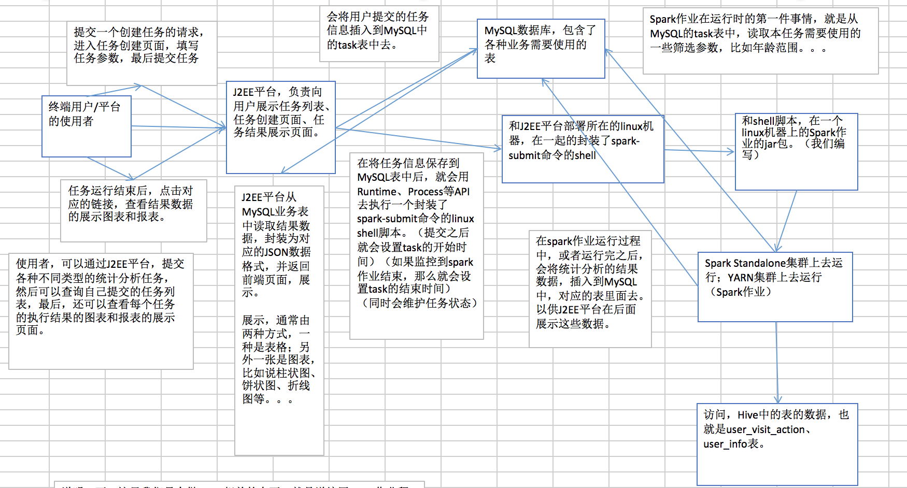

# 电商用户行为分析大数据平台

## 项目介绍

1.基于Spark开发的平台

2.需要有spark基础

3.有很多高级知识和设计模式

4.电商用户行为分析大数据平台（项目名称）

5.访问行为，购物行为，广告点击行为，对这些行为进行分析，使用大数据技术来帮助公司提升业绩。

6.主要的功能模块有用户session分析，页面单跳转化率统计，热门商品离线统计，广告流量实时统计等4个业务模块。

7.所使用的知识点是spark core，spark SQL，spark streaming等三个技术框架。

8.主要是数据倾斜，线上故障，性能调优，troubleshooting等经验的讲解。

9.希望达到的效果，等于公司做的项目。

10.需求分析，方案设计，数据设计，编码实现，测试以及性能调优等环节。

## 模块简介

1、用户访问session分析：该模块主要是对用户访问session进行统计分析，包括session的聚合指标计算、按时间比例随机抽取session、获取每天点击、下单和购买排名前10的品类、并获取top10品类的点击量排名前10的session。该模块可以让产品经理、数据分析师以及企业管理层形象地看到各种条件下的具体用户行为以及统计指标，从而对公司的产品设计以及业务发展战略做出调整。主要使用Spark Core实现。

2、页面单跳转化率统计：该模块主要是计算关键页面之间的单步跳转转化率，涉及到页面切片算法以及页面流匹配算法。该模块可以让产品经理、数据分析师以及企业管理层看到各个关键页面之间的转化率，从而对网页布局，进行更好的优化设计。主要使用Spark Core实现。

3、热门商品离线统计：该模块主要实现每天统计出各个区域的top3热门商品。然后使用Oozie进行离线统计任务的定时调度；使用Zeppeline进行数据可视化的报表展示。该模块可以让企业管理层看到公司售卖的商品的整体情况，从而对公司的商品相关的战略进行调整。主要使用Spark SQL实现。

4、广告流量实时统计：该模块负责实时统计公司的广告流量，包括广告展现流量和广告点击流量。实现动态黑名单机制，以及黑名单过滤；实现滑动窗口内的各城市的广告展现流量和广告点击流量的统计；实现每个区域每个广告的点击流量实时统计；实现每个区域top3点击量的广告的统计。主要使用Spark Streaming实现。

## 用户访问Session分析模块

用户session功能介绍

1.对用户访问session进行分析，可以根据使用者指定的某些条件筛选出指定的一些用户，对用户在指定日期范围内发起session，进行聚合统计，比如统计出访问时长在某段时间的session占总session数量的比例，按时间比例。

2.JDBC辅助类封装

3.获取点击量，下单量和支付量都排名10的商品种类

4.获取top10的商品种类的点击数量排名前10的session

5.开发完毕了以上功能以后，需要进行大量，复杂，高端，全套的性能调优。

6.10亿数据量的troubleshooting的经验总结

7.数据倾斜的完美解决方案，数据倾斜往往是大数据处理程序的性能杀手。

8.把使用moc的数据，对模块进行处理，调试。

## 实际架构

1.javaee平台接受到执行统计分析任务的请求之后，会调用封装了spark-submit的shell脚本执行。

2.spark作业获取指定参数，然后运行复杂的作业逻辑，进行该模块的统计和分析。

3.spark作业统计和分析的结果，会写入mySQL中，指定的表。

4.最后通过Javaee进行结果展示。

## 用户访问session介绍

1.用户在电商网站上，通常会有很多点击行为，首页通常都是进入首页，然后可能点击首页上的一些商品，点击首页上的一些品类，也可能随时在搜索框里面搜索关键词，还可能将一些商品加入购物车，对购物车中的多个商品下订单，最后对订单中的多个商品进行支付。

2.用户的每一次操作，可以理解为一个action，比如支付。

3.用户session，指的是用户第一次进入首页，session就开始了。然后在一定时间范围内，直到最后结束，离开网站，关闭浏览器，或者长时间没有操作，那么session就结束了，

4.以上用户在网站内的访问过程，就称为一次session。简单的说，session就是某一天时间内，某个用户对网站从打开或者进入，到做了大量操作，关闭浏览器的过程。就叫做session。

## 数据结构的介绍
### user_visit_action表

&nbsp;&nbsp;&nbsp;&nbsp;&nbsp;&nbsp;其实就是放，比如说网站，或者是app，每天的点击流的数据。可以理解为，用户对网站/app每点击一下，就会代表在这个表里面的一条数据。 

表名：user_visit_action（Hive表）

date：日期，代表这个用户点击行为是在哪一天发生的

user_id：代表这个点击行为是哪一个用户执行的

session_id ：唯一标识了某个用户的一个访问session

page_id:点击了某些商品/品类，也可能是搜索了某个关键词，然后进入了某个页面，页面的id

action_time:这个点击行为发生的时间点

search_keyword:如果用户执行的是一个搜索行为，比如说在网站/app中，搜索了某个关键词，然后会跳转到商品列表页面；搜索的关键词

click_category_id:可能是在网站首页，点击了某个品类（美食、电子设备、电脑）

click_product_id:可能是在网站首页，或者是在商品列表页，点击了某个商品（比如呷哺呷哺火锅XX路店3人套餐、iphone 6s）

order_category_ids:代表了可能将某些商品加入了购物车，然后一次性对购物车中的商品下了一个订单，这就代表了某次下单的行为中，有哪些商品品类，可能有6个商品，但是就对应了2个品类，比如有3根火腿肠（食品品类），3个电池（日用品品类）

order_product_ids:某次下单，具体对哪些商品下的订单

pay_category_ids:代表的是，对某个订单，或者某几个订单，进行了一次支付的行为，对应了哪些品类

pay_product_id:代表的，支付行为下，对应的哪些具体的商品

### user_info表

&nbsp;&nbsp;&nbsp;&nbsp;&nbsp;&nbsp;&nbsp;实际上，就是一张最普通的用户基础信息表；这张表里面，其实就是放置了网站/app所有的注册用户的信息。那么我们这里也是对用户信息表，进行了一定程度的简化。比如略去了手机号等这种数据。因为我们这个项目里不需要使用到某些数据。那么我们就保留一些最重要的数据，即可。 

表名：user_info（Hive表）

user_id：其实就是每一个用户的唯一标识，通常是自增长的Long类型，BigInt类型

username：是每个用户的登录名

name：每个用户自己的昵称、或者是真实姓名

age：用户的年龄

professional：用户的职业

city：用户所在的城市

### task表

&nbsp;&nbsp;&nbsp;&nbsp;&nbsp;&nbsp;其实是用来保存平台的使用者，通过J2EE系统，提交的基于特定筛选参数的分析任务，的信息，就会通过J2EE系统保存到task表中来。之所以使用MySQL表，是因为J2EE系统是要实现快速的实时插入和查询的。 

表名：task（MySQL表）

task_id：表的主键

task_name：任务名称

create_time：创建时间

start_time：开始运行的时间

finish_time：结束运行的时间

task_type：任务类型，就是说，在一套大数据平台中，肯定会有各种不同类型的统计分析任务，比如说用户访问session分析任务，页面单跳转化率统计任务；所以这个字段就标识了每个任务的类型

task_status：任务状态，任务对应的就是一次Spark作业的运行，这里就标识了，Spark作业是新建，还没运行，还是正在运行，还是已经运行完毕

task_param：最最重要，用来使用JSON的格式，来封装用户提交的任务对应的特殊的筛选参数.

### 总体任务的流程

## 用户访问Session分析需求分析
## 需求分析

&nbsp;&nbsp;&nbsp;&nbsp;&nbsp;&nbsp;&nbsp;在互联网企业中，需求分析，首先就是要和产品经理也就是负责设计你开发的大数据平台产品的人，去大量开会，去沟通需求的细节。

1.按条件筛选session

&nbsp;&nbsp;&nbsp;&nbsp;&nbsp;&nbsp;&nbsp;搜索过某些关键词的用户，访问时间在某个时间段的用户，年纪在某个范围的用户，职业在某个范围内的用户，所在某个城市的用户，发起的session。找到对应用户的session，也就是我们所说的第一步，按照条件筛选session。

最大的作用就是灵活。也就是说可以让使用者，对感兴趣的和关心的用户群体，进行后续各个复杂业务逻辑的统计和分析，那么拿到结果数据就是只是针对特殊用户群体的分析结果。

2.统计出符合条件的session中，访问时长在1-2s，4-6s等各个范围内的session占比等。

&nbsp;&nbsp;&nbsp;&nbsp;&nbsp;&nbsp;&nbsp;session访问时长，也就是说一个session对应的开始的action，到结束的session，之间的时间范围。还有，就是访问步长，指的是，一个session执行期间内，依次点击多少个页面。

可以让人从全局的角度看到，符合某些条件的用户群体，使用产品的习惯，对于使用者来说，有一个全局和清晰的认识。

3.在符合添加的session中，按照时间比例随机抽取1000个session。

&nbsp;&nbsp;&nbsp;&nbsp;&nbsp;&nbsp;&nbsp;这个功能的作用是可以让使用者，能够对符合条件的session，按照时间比例均匀的随机采取1000个session，然后观察每个session具体的点击流行为，比如先进入首页，然后点击食品品类，然后点具体商品，然后下单支付。

之所以使用随机采样，就是观察样本的公平性。

4.在符合条件的session中，获取点击，下单和支付数量前10的品类。

&nbsp;&nbsp;&nbsp;&nbsp;&nbsp;&nbsp;&nbsp;计算出所有这些session对各个品类的点击，下单和支付的次数，然后按照这三个属性进行排序，获取前10品类。

这个功能很重要，可以让我们明白就是符合条件的用户，他最感兴趣的商品是什么总类，这个可以让公司里的人，清晰地了解不同的层次，不同的用户的心理和喜好。

5.对排名前10的品类，分别获取其点击次数排名前10的session

&nbsp;&nbsp;&nbsp;&nbsp;&nbsp;&nbsp;&nbsp;这个功能可以让我们了解对某个用户群体最感兴趣的品类，各个品类最感兴趣最典型的用户的session的行为

用户访问session分析技术方案

这个过程涉及到技术的选型，前端是JavaEE+Spark+MySQL。实现需求，你的技术实现思路，以及在思路中，可能使用到的技术要点。

1.按条件筛选
&nbsp;&nbsp;&nbsp;&nbsp;&nbsp;&nbsp;&nbsp;&nbsp;&nbsp;&nbsp;按条件筛选session，但是这个筛选的粒度是不同的，比如说搜索词，访问时间，那么这个都是session粒度，甚至是action粒度，那么还有，就是针对用户的基础信息进行筛选，年龄，性别，职业，所以说筛选粒度是不统一的。

每天的用户访问数据量是很大的，针对于筛选粒度不统一的问题，以及数据量巨大，可能会有两个问题，首先第一个，就是如果不统一筛选粒度，那么就必须得对所有的数据进行全量的扫描，第二个就是扫描的话，量实在是太大了。

为了解决以上问题，我们这里对原始的数据进行聚合，什么粒度聚合呢？session粒度的聚合。也就是说，用一些最基本的筛选条件，比如时间范围，从hive表中提取数据，

然后呢，按照session ID这个字段进行聚合统计那么聚合后的一天记录，就是一个用户的某个session在指定时间内的访问记录，比如搜过所有的关键词，点击过的所有品类ID点击session对应的userID关联的用户的基础信息。

聚合过后，针对session粒度的数据，按照使用者指定的筛选条件，进行数据的筛选。筛选出来符合条件的用户session粒度数据，其实就是我们想要的那些session。

2.聚合统计

&nbsp;&nbsp;&nbsp;&nbsp;&nbsp;&nbsp;&nbsp;&nbsp;&nbsp;对于某个时间段的session的数量，就需要累加，基本上实现这个最好的选择就是accumulator变量，但是问题又来了如果使用基础的accumulator变量，导致维护变得更加复杂，在修改代码的时候，很可能会导致错误。

我们可以使用自定义的accumulator的技术，实现复杂的分布式计算。

3.在符合条件的session中，按照时间比例随机抽取1000个session

&nbsp;&nbsp;&nbsp;&nbsp;&nbsp;&nbsp;&nbsp;&nbsp;&nbsp;使用groupbykey等算子进行计算

4.在符合条件的session中，获取点击下单和支付数量排名前10的品类

&nbsp;&nbsp;&nbsp;&nbsp;&nbsp;&nbsp;&nbsp;&nbsp;&nbsp;需要对每个品类的点击，下单和支付数量都进行计算。使用spark的自定义key进行二次排序技术，来实现所有的品类，按照三个字段，点击数量，下单数量，支付数量依次进行排序，首先比较点击数量，如果相同的话，那么比较下单数量，如果还是相同，那么比较支付数量。

5.对排名前10的品类，分别获取点击次数前10的session  

&nbsp;&nbsp;&nbsp;&nbsp;&nbsp;&nbsp;&nbsp;&nbsp;&nbsp;这个需求，需要使用spark的分组获取topN的算法进行实现。也就是对排名前10的品类对应的数据，按照品类ID进行分组，然后求出每组点击数量排名前10的session。

### 总结

总结一下，可以学习到的知识点

1.通过底层数据聚合，来减少spark作业处理数据，从而提升spark作业的性能，从根本上提升spark性能的技巧。

2.自定义accumulator实现复杂分布式计算的技术

3.spark按时间比例随机抽取算法

4.spark自定义key二次排序技术

5.spark分组取topN算法

6.通过spark的各个功能和技术点，进行各种聚合，采样，排序，取topN业务的实现。

## 用户访问session数据表分析

&nbsp;&nbsp;&nbsp;&nbsp;&nbsp;&nbsp;&nbsp;在进行完了数据调研、需求分析、技术实现方案，进行数据设计。数据设计，往往包含两个环节，第一个呢，就是说，我们的上游数据，就是数据调研环节看到的项目基于的基础数据，是否要针对其开发一些Hive ETL，对数据进行进一步的处理和转换，从而让我们能够更加方便的和快速的去计算和执行spark作业；第二个，就是要设计spark作业要保存结果数据的业务表的结构，从而让J2EE平台可以使用业务表中的数据，来为使用者展示任务执行结果。 

第一表：session_aggr_stat表，存储第一个功能，session聚合统计的结果

    CREATE TABLE `session_aggr_stat` (
      `task_id` int(11) NOT NULL,
      `session_count` int(11) DEFAULT NULL,
      `1s_3s` double DEFAULT NULL,
      `4s_6s` double DEFAULT NULL,
      `7s_9s` double DEFAULT NULL,
      `10s_30s` double DEFAULT NULL,
      `30s_60s` double DEFAULT NULL,
      `1m_3m` double DEFAULT NULL,
      `3m_10m` double DEFAULT NULL,
      `10m_30m` double DEFAULT NULL,
      `30m` double DEFAULT NULL,
      `1_3` double DEFAULT NULL,
      `4_6` double DEFAULT NULL,
      `7_9` double DEFAULT NULL,
      `10_30` double DEFAULT NULL,
      `30_60` double DEFAULT NULL,
      `60` double DEFAULT NULL,
      PRIMARY KEY (`task_id`)
    ) ENGINE=InnoDB DEFAULT CHARSET=utf8
    

第二个表：session_random_extract表，存储我们的按时间比例随机抽取功能抽取出来的1000个session

    CREATE TABLE `session_random_extract` (
      `task_id` int(11) NOT NULL,
      `session_id` varchar(255) DEFAULT NULL,
      `start_time` varchar(50) DEFAULT NULL,
      `end_time` varchar(50) DEFAULT NULL,
      `search_keywords` varchar(255) DEFAULT NULL,
      PRIMARY KEY (`task_id`)
    ) ENGINE=InnoDB DEFAULT CHARSET=utf8
    

第三个表：top10_category表，存储按点击、下单和支付排序出来的top10品类数据

    CREATE TABLE `top10_category` (
      `task_id` int(11) NOT NULL,
      `category_id` int(11) DEFAULT NULL,
      `click_count` int(11) DEFAULT NULL,
      `order_count` int(11) DEFAULT NULL,
      `pay_count` int(11) DEFAULT NULL,
      PRIMARY KEY (`task_id`)
    ) ENGINE=InnoDB DEFAULT CHARSET=utf8;
    

第四个表：top10_category_session表，存储top10每个品类的点击top10的session

    CREATE TABLE `top10_category_session` (
      `task_id` int(11) NOT NULL,
      `category_id` int(11) DEFAULT NULL,
      `session_id` varchar(255) DEFAULT NULL,
      `click_count` int(11) DEFAULT NULL,
       PRIMARY KEY (`task_id`)
    ) ENGINE=InnoDB DEFAULT CHARSET=utf8;
    

最后一张表：session_detail，用来存储随机抽取出来的session的明细数据、top10品类的session的明细数据

    CREATE TABLE `session_detail` (
      `task_id` int(11) NOT NULL,
      `user_id` int(11) DEFAULT NULL,
      `session_id` varchar(255) DEFAULT NULL,
      `page_id` int(11) DEFAULT NULL,
      `action_time` varchar(255) DEFAULT NULL,
      `search_keyword` varchar(255) DEFAULT NULL,
      `click_category_id` int(11) DEFAULT NULL,
      `click_product_id` int(11) DEFAULT NULL,
      `order_category_ids` varchar(255) DEFAULT NULL,
      `order_product_ids` varchar(255) DEFAULT NULL,
      `pay_category_ids` varchar(255) DEFAULT NULL,
      `pay_product_ids` varchar(255) DEFAULT NULL,
      PRIMARY KEY (`task_id`)
    ) ENGINE=InnoDB DEFAULT CHARSET=utf8;
    

额外的一张表：task表，用来存储J2EE平台插入其中的任务的信息

    CREATE TABLE `task` (
      `task_id` int(11) NOT NULL AUTO_INCREMENT,
      `task_name` varchar(255) DEFAULT NULL,
      `create_time` varchar(255) DEFAULT NULL,
      `start_time` varchar(255) DEFAULT NULL,
      `finish_time` varchar(255) DEFAULT NULL,
      `task_type` varchar(255) DEFAULT NULL,
      `task_status` varchar(255) DEFAULT NULL,
      `task_param` text,
      PRIMARY KEY (`task_id`)
    ) ENGINE=InnoDB AUTO_INCREMENT=1 DEFAULT CHARSET=utf8;
    

完成了数据调研、需求分析、技术方案设计、数据设计以后，正式进入编码实现和功能测试阶段。最后才是性能调优阶段。 

